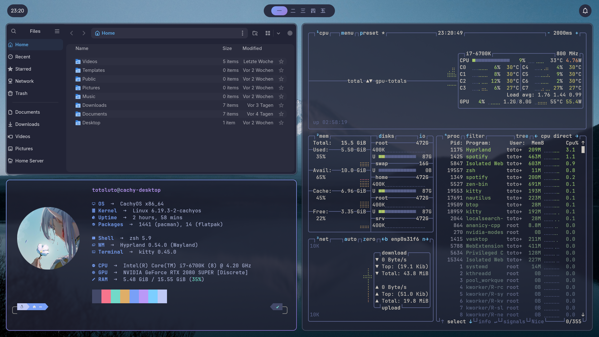

Here’s a **much simpler version** of your README, keeping the essentials and adding a clear **place for a screenshot**, while removing all emojis:

---

# Hyprland Desktop Environment Configuration

## Overview

This repository provides a ready-to-use configuration for the Hyprland window manager, including an installation script and configuration files for applications like Kitty, Waybar, Flameshot, Hyprlock, Hyprpaper, Rofi, and more. It is designed to give a functional and customizable desktop environment with minimal setup.



---

## Features

* Installation script to set up Hyprland and related applications.
* Pre-configured settings for Waybar, Kitty, Flameshot, Rofi, Hyprlock, Hyprpaper, SwayNC, and FastFetch.
* System-wide font and GTK theme installation.
* Customizable workflow with keyboard shortcuts, autostart, and floating windows.

---

## Installation

1. Ensure you have a CachyOS installation with hyprland.
2. Clone the repository:

   ```bash
   git clone <repository-url>
   ```
3. Run the installation script:

   ```bash
   cd <repository-folder>
   ./install.sh
   ```
4. Restart your session or open a new terminal to start using the setup.

## Project Structure

```
.
├── install.sh
├── kitty
│   └── kitty.conf
├── flameshot
│   └── flameshot.ini
├── waybar
│   └── config.jsonc
├── swaync
│   └── config.json
├── fastfetch
│   └── config.jsonc
├── hypr
│   ├── hyprlock.conf
│   ├── hyprpaper.conf
│   └── hyprland.conf
├── rofi
│   └── launcher.rasi
└── README.md
```
